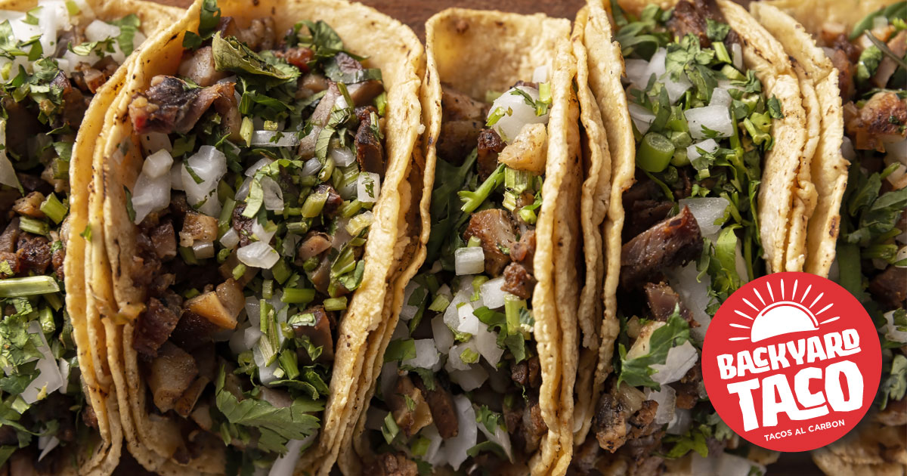
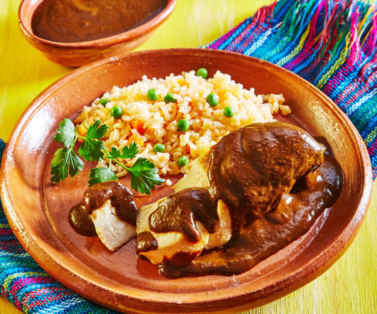
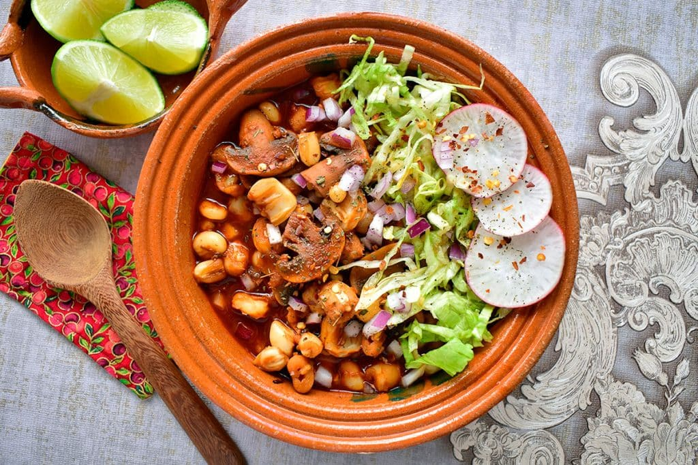
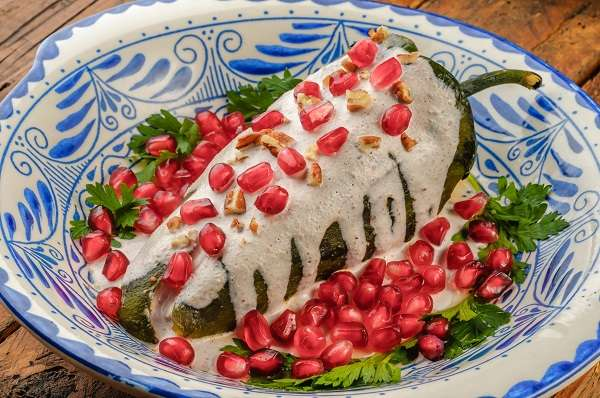

# Comidas Más Reconocidas de México

México es famoso por su rica y variada gastronomía, reconocida como Patrimonio Cultural Inmaterial de la Humanidad por la UNESCO. Aquí hay una lista de algunas de las comidas más reconocidas de México:

# 1. Tacos
Los tacos son el platillo más emblemático de México. Se trata de tortillas de maíz o harina rellenas de una variedad de ingredientes. Los tipos más populares incluyen:
- **Tacos al pastor**: carne de cerdo marinada en achiote y especias, cocida en un trompo vertical y servida con piña, cebolla y cilantro.
- **Tacos de asada**: carne de res asada, usualmente acompañada con cebolla, cilantro y salsa.
- **Tacos de carnitas**: carne de cerdo cocida en su propia grasa hasta que queda tierna y jugosa.

# 2. Mole
El mole es una salsa espesa y rica, hecha con una mezcla compleja de chiles, especias, chocolate y otros ingredientes. Los más famosos son:
- **Mole poblano**: originario de Puebla, conocido por su mezcla de sabores dulces y picantes.
- **Mole negro**: típico de Oaxaca, caracterizado por su color oscuro y sabor profundo.

# 3. Pozole
El pozole es una sopa tradicional a base de maíz cacahuazintle (un tipo de maíz hominy), carne (generalmente cerdo), y se adereza con una variedad de ingredientes como lechuga, rábanos, cebolla, orégano, chile y limón. Hay tres tipos principales:
- **Pozole rojo**: con chiles rojos.
- **Pozole verde**: con salsa de tomatillo y chiles verdes.
- **Pozole blanco**: sin chiles, más sencillo pero igualmente delicioso.

# 4. Tamales
Los tamales son masa de maíz rellena de carnes, chiles, frutas u otros ingredientes, envueltos en hojas de maíz o plátano y cocidos al vapor. Algunos tipos son:
- **Tamales de rajas**: rellenos de tiras de chile poblano y queso.
- **Tamales de mole**: rellenos de carne y mole.
- **Tamales dulces**: masa de maíz mezclada con frutas o dulce de leche.

# 5. Chiles en Nogada
Un platillo típico de Puebla, los chiles en nogada consisten en chiles poblanos rellenos de picadillo (mezcla de carne de res y cerdo, frutas y especias), cubiertos con una salsa de nuez (nogada) y decorados con granada y perejil, representando los colores de la bandera mexicana.

## Recetas

Aca se dejan varios links con recetas mexicanas, las cuales prodrias hacer, si quieres probar la cultura mexicana:

- [Receta de Tacos](https://www.pequerecetas.com/receta/receta-de-tacos-mexicanos-caseros/)
- [Receta de Tamales](https://www.comedera.com/receta-tamales-mexicanos/)
- [Receta de Pozole](https://www.paulinacocina.net/pozole-rojo/28500)
